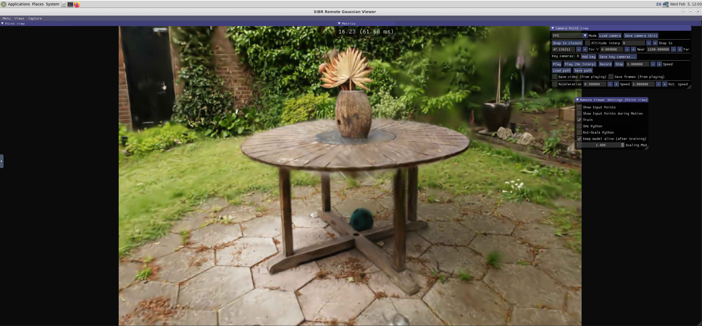

<link rel="stylesheet" href="../../../assets/stylesheets/images.css">

# Gaussian Splatting

## Overview

This page shows how to perform the Gaussian Splatting reconstruction technique on the University of Arizona's HPC. This process is different than other forms of 3d reconstruction like photogrammetry in that it doesn't attempt to construct a 3d surface of the real world scene. Instead a collection of 3d ellipsoids are generated who's color properties when viewed from a specific perspective resemble input images provided. For further background consult the original paper [here](https://arxiv.org/abs/2308.04079).


## Steps

### Setup

Ensure that you are using an allocation with a GPU preferrably a interactive desktop (for the interactive viewer step).

Make a project folder and transfer the images you have to a sub folder called `images` 

```
project_folder
|---images 
```
Navigate into that directory for the following steps

### Structure from Motion (SfM)
```
module load contrib
module load chrisreidy/baylyd/colmap

start_colmap feature_extractor --database_path database.db --image_path images --ImageReader.camera_model SIMPLE_PINHOLE
start_colmap exhaustive_matcher --database_path database.db

start_glomap mapper --image_path images --database_path database.db --output_path sparse
```

**Troubleshooting**

If this error appears

```
I0205 11:31:57.138674  8177 misc.cc:44] 
==============================================================================
Feature matching
==============================================================================
I0205 11:31:57.320924  8179 sift.cc:1426] Creating SIFT GPU feature matcher
I0205 11:31:57.409721  8177 pairing.cc:168] Generating exhaustive image pairs...
I0205 11:31:57.409775  8177 pairing.cc:201] Matching block [1/8, 1/8]
terminate called recursively
terminate called after throwing an instance of 'std::domain_error'
*** Aborted at 1738780317 (unix time) try "date -d @1738780317" if you are using GNU date ***
  what():  Camera model does not exist
PC: @                0x0 (unknown)
*** SIGABRT (@0x632f00001fcb) received by PID 8139 (TID 0x7fcf367fc000) from PID 8139; stack trace: ***
    @     0x7fcf92f74046 (unknown)
    @     0x7fcf6f602520 (unknown)
    @     0x7fcf6f6569fc pthread_kill
    @     0x7fcf6f602476 raise
    @     0x7fcf6f5e87f3 abort
    @     0x7fcf6f89942a __gnu_cxx::__verbose_terminate_handler()
    @     0x7fcf6f89720c (unknown)
    @     0x7fcf6f897277 std::terminate()
    @     0x7fcf6f8974d8 __cxa_throw
    @     0x55b4f490586c colmap::CameraModelCamFromImg()
    @     0x55b4f4eb1dae colmap::EstimateCalibratedTwoViewGeometry()
    @     0x55b4f4eb2ca5 colmap::EstimateTwoViewGeometry()
    @     0x55b4f487559b colmap::(anonymous namespace)::VerifierWorker::Run()
    @     0x55b4f49220d6 colmap::Thread::RunFunc()
    @     0x7fcf6f8c5253 (unknown)
    @     0x7fcf6f654ac3 (unknown)
    @     0x7fcf6f6e5a04 clone

```

Just attempt the same command again. 

### Resizing images

```
module load contrib
module load chrisreidy/baylyd/gaussian_splat

resize_images --skip_matching --resize --skip_undistort -s $PWD
```
### Starting the interactive Viewer

```
module load contrib
module load chrisreidy/baylyd/gaussian_splat
run_gaussian_viewer
```
### Running Gaussian Splat

```

module load contrib
module load chrisreidy/baylyd/gaussian_splat

# -s pass the present working directory as source to the gaussian splat executable
# -m pass the present working directory as output destination for trained model
run_gaussian_splat -s $(pwd -P) -m $(pwd -P)


```


